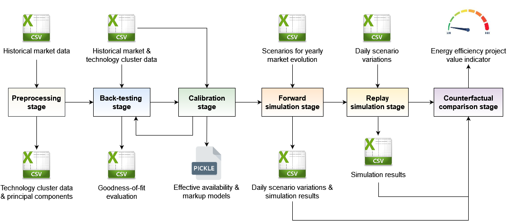

<br/>

[](https://badge.fury.io/py/eevalue-tool)

# Estimating the value of energy efficiency as a grid resource

The ongoing EU goal for the decarbonisation of the power system means that decentralized and fluctuating solar- and wind-driven power generation substitutes more and more power from dispatchable, fossil-fuelled power plants. This results to increased variability of supply and to power system operators requiring more options to efficiently handle the stability and adequacy challenges of the power grid. While the most often suggested option is demand flexibility, i.e. the fast-responding adaptation of power consumption to the variable generation, the H2020 project [SENSEI](https://senseih2020.eu/) examined the role that energy efficiency, i.e. the persistent and maintained changes in power consumption compared to a baseline level, can play in a renewables-based electricity system. 

Energy efficiency improvements may affect power consumption in two (2) ways:

1. Decrease power consumption by improving the efficiency of a piece of electric equipment (such as the efficiency of an air cooling system) or reducing the total amount of work that must be performed by an existing piece of electric equipment (such as upgrading envelope insulation so that to reduce the cooling load);


2. Increase power consumption due to fuel substitution, such as when an old oil-fuelled boiler is replaced by an electric heat pump.  

Accordingly, energy efficiency improvements may reduce power demand during the hours when the probability of load loss is high and/or hours when persistent variability in the net load leads to ramping events. In both of these cases, energy efficiency can help phase out old, polluting power plants that are only kept commissioned for the provision of capacity reserves, as well as reduce the amount of new generation capacity that is needed to serve the future load growth. On the other hand, there are times when increased power demand may be actually beneficial, such as during periods of renewable power over-generation and curtailment. If energy efficiency interventions reduced power demand during those hours, the system needs for demand flexibility would increase. 

Under this perspective, energy efficiency could be regarded by the power grid as a *load modifying resource*: although it is not dispatchable by the power or capacity market, energy efficiency is able to persistently modify the power system’s load shape in ways that harmonize with the system operator’s goals, such as peak shaving, increased hosting capacity for renewables, reducing steep upward and downward ramps, and reducing the overall costs of power procurement. 

In general, a load modifying resource would be most valuable if it could induce persistent changes in the power consumption profile that increase demand during some time periods and decrease demand during others, so that to better align with the daily/seasonal net load profile. This means that the value of an energy efficiency project for the power grid is highly dependent on the temporal profile of the power consumption changes that it induces: some aspects of a consumption profile change may increase the value of the project, such as when power demand decreases during periods of high probability of capacity deficit, while others decrease its value, such as when the probability of renewable generation curtailment is increased.

The `eevalue` Python package quantifies the value of an energy efficiency project for the power grid through a composite indicator that consolidates the different ways the project affects the grid. A project can be considered as grid positive if the positive impacts outweigh the negative. The `eevalue` methodology is implemented using the same process and the same tools that system operators use for capacity adequacy studies. There are two (2) reasons for this approach. The first reason is that the coordination between the needs of the power system and the incentives for energy efficiency improvements must take place during the medium-term planning for resource adequacy in the power system. The second reason is to showcase that the design of a program that compensates energy efficiency for its contribution to the grid does not need a radically new toolset, but can be done using the tools that power system operators already use for capacity adequacy planning.

## Installation

The `eevalue` tool can be installed through PyPI:

```bash
pip install eevalue-tool
```

**Note that the tool's functionality relies on the availability of a linear programming solver**. By default, the [HiGHS](https://highs.dev/) solver is used by `eevalue`. HiGHS is freely available under the MIT licence, and can be downloaded from [Github](https://github.com/ERGO-Code/HiGHS). Alternatively, binaries for all platforms can be downloaded from AMPL's [website for open-source solvers](https://ampl.com/products/solvers/open-source-solvers/). In all cases, the HiGHS executable file must be included in the PATH environment variable.   

## Usage

All the functionality in `eevalue` is organized around data pipelines. Each pipeline consumes data and other artifacts (such as models) produced by a previous pipeline, and produces new data and artifacts for its successor pipelines.

There are eight (8) pipelines in `eevalue`.

### `preprocess`

The preprocessing stage implements the clustering of the power plants based on their technology (such as combined cycle gas turbines or steam turbines) and primary fuel (such as natural gas, coal or water/hydro). The quantitative analysis in `eevalue` utilizes a unit commitment model to identify the conditions under which energy efficiency improvements are most valuable for the power system and its operation. To limit the computational cost of solving unit commitment problems, power plants are aggregated into a small number of clusters.

Furthermore, this stage performs Principal Components Analysis (PCA) on a data matrix that includes all hourly historical time series, and stores the principal components that explain up to 90% of the variability (this is a user-defined parameter and can be changed). The components are utilized during simulation to generate scenarios for all hourly time series (such as demand, wind and solar availability factors, maximum levels of power imports and exports, and so on).

The command
```bash
eevalue preprocess --help
```
prints the documentation for all the options that can be passed to the command line for the preprocessing stage.

### `backtest`

The back-testing stage runs a simulation using historical data so as to compare actual and predicted results in terms of committed capacities per technology cluster. This helps evaluate how well the simulation model performs, as well as whether calibration to historical data is required.

The command
```bash
eevalue backtest --help
```
prints the relevant documentation.

### `calibrate`

The calibration stage is a sequence of two (2) steps:

* The 1st step identifies a function that predicts the *effective availability factor* of the hydropower resources (if they exist). Although nominal availability data for hydropower plants can be found from the respective system operators’ web sites, the corresponding capacity cannot be used in an unconstraint fashion, since reservoir water levels cannot be replenished at will. The effective availability factor of the hydropower resources is estimated as a function of their nominal availability factor and the value of water. The latter is quantified as the inverse of the ratio of the reservoirs’ filling rate to their long-term average. 


* The 2nd step identifies a function that generates a markup to be added to the variable cost of each technology cluster given the power system’s conditions. For such a function to make sense, it should be consistently related to factors that one would expect to define the power plants’ bidding decisions: the levels of net load and available capacity in the system, and the value of water.

The command
```bash
eevalue calibrate --help
```
prints the relevant documentation.

### `simulate`

This stage creates forward scenarios for the parameters that define the state of the power system (such as demand, available generation capacity, etc.), runs the corresponding simulations, and stores both the scenarios and the results. By default, the model stores results on committed capacities per technology cluster, curtailment of renewable generation and missing peak and ramping capacity.  

The command
```bash
eevalue simulate --help
```
prints the relevant documentation.

### `replay`

This stage simulates the same scenarios that the `simulate` stage created and simulated, but now adds storage and/or load modifying resources. The goal is to identify: (a) how to best utilize the available storage and/or load modifying resources, and (b) what these resources’ impact is on the system’s probability of capacity deficit and renewable power curtailment. 

The command
```bash
eevalue replay --help
```
prints the relevant documentation.

### `compare`

This stage compares the results of the two (2) previous steps to construct an indicator that associates storage capacity levels and/or load profile changes at specific hours of the year with reductions in capacity deficit and renewable power curtailment. This indicator defines the *grid friendliness* of an energy efficiency project given its pre- and post-retrofit power consumption profiles. 

The command
```bash
eevalue compare --help
```
prints the relevant documentation.

### `ordc`

Estimates and stores the [operating reserve demand curve](https://papers.ssrn.com/sol3/papers.cfm?abstract_id=3383058) (ORDC) of the simulated system.

The command
```bash
eevalue ordc --help
```
prints the relevant documentation.

### `runs`

Prints out the stored MLflow runs (filtered by tags). Every time a pipeline runs (except for the `preprocess` pipeline), its results are stored using [MLFlow](https://www.mlflow.org/) tracking. This means that each run gets its own id, and all its results can be retrieved and reused using this id. 

The command
```bash
eevalue runs --help
```
prints the relevant documentation.

The whole workflow is summarised in the diagram below:


<br/>
<br/>

## Additional information

Details for the implementation of all the pipelines can be found in the document *The drivers of the value of energy efficiency as an energy resource* available at [Zenodo](https://zenodo.org/record/6797898#.YzGWfnZBxdg).

<br/>

